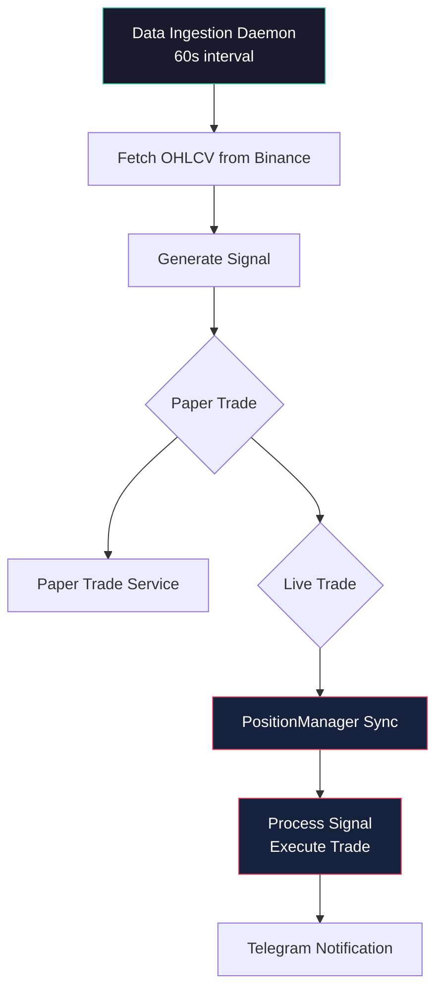
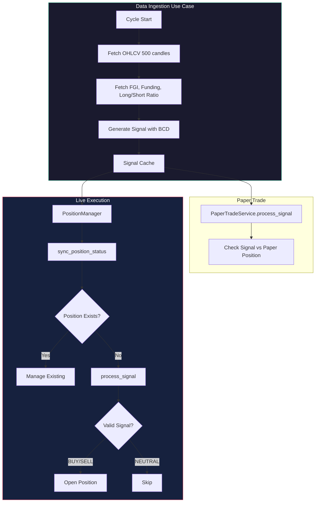
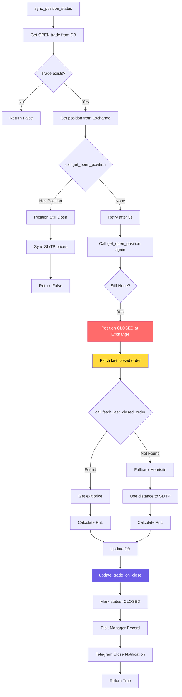
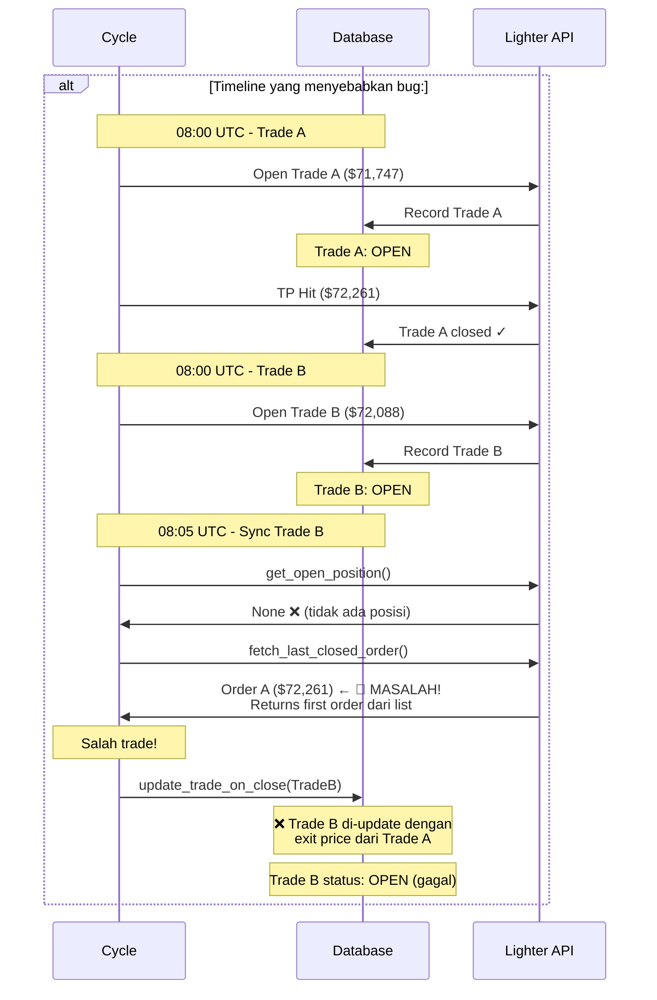
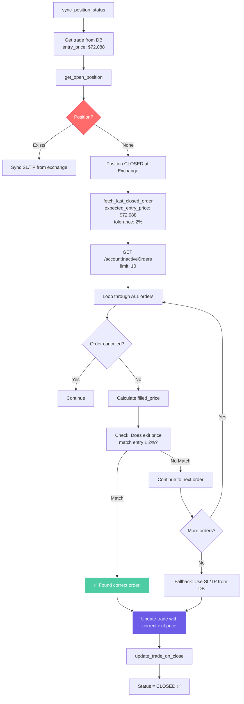
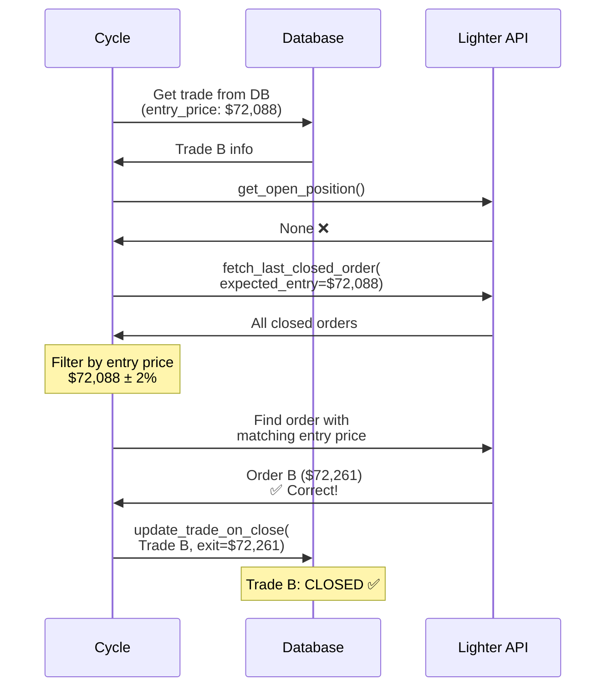

# BTC-Scalping System Flow Diagram

## Overview



## Detailed Ingestion Cycle



## PositionManager Sync Flow



## BUG LOCATION - Root Cause

### Masalah:
`fetch_last_closed_order()` mengembalikan **FIRST** order dari list tanpa filtering - bisa dapat order dari trade sebelumnya!

```mermaid
flowchart TD
    subgraph BUG["🔴 BUG: fetch_last_closed_order()"]
        A[Position closed at Exchange<br/>get_open_position() = None] --> B[Fetch last closed order]
        
        B --> C["fetch_last_closed_order()"]
        C --> D[GET /accountInactiveOrders<br/>limit=10]
        D --> E[Get list of closed orders<br/>[OrderTradeB, OrderTradeA, ...]]
        E --> F[Loop through orders]
        F --> G[Skip canceled orders]
        G --> H[Calculate filled_price]
        H --> I{Order valid?}
        I -->|No| J[Continue to next order]
        I -->|Yes| K[Return FIRST order found]
        
        K --> L[🔴 PROBLEM: Returns FIRST order]
        L --> M[OrderTradeA - bukan<br/>OrderTradeB yang lagi di-sync!]
        
        M --> N[Update DB with wrong exit price]
        N --> O[❌ DB still shows OPEN<br/>OR wrong trade updated]
    end
    
    style A fill:#ff6b6b,stroke:#e94560,color:#fff
    style L fill:#ffd93d,stroke:#6c5ce7,color:#000
    style O fill:#e94560,stroke:#fff,color:#fff
```

### Timeline Race Condition:



## FIXED FLOW - With Entry Price Filtering

### Solution: Filter dengan expected_entry_price



### Fixed Sequence Diagram:



## Files Involved

| File | Responsibility |
|------|-----------------|
| `data_ingestion_use_case.py` | Main daemon loop |
| `position_manager.py` | Sync + Execute |
| `lighter_execution_gateway.py` | Lighter API calls |
| `live_trade_repository.py` | DB read/write |

## Summary - Root Cause & Fix

### Root Cause:
`fetch_last_closed_order()` mengembalikan **FIRST** closed order dari list tanpa filtering by entry price. Ketika multiple trades ada di list, fungsi ini bisa return order dari trade sebelumnya - bukan yang sedang di-sync!

### Why This Happens:
1. API `/accountInactiveOrders` mengembalikan list 10 orders terbaru
2. Fungsi loop dan ambil **pertama** yang valid (tidak canceled)
3. Tidak ada filter "Apakah ini order untuk trade yang lagi di-sync?"
4. Result: bisa dapat order dari trade sebelumnya

### Fix yang Diperlukan:

**File:** `lighter_execution_gateway.py`
```python
async def fetch_last_closed_order(
    self,
    expected_entry_price: Optional[float] = None,  # ← TAMBAHKAN
    tolerance_pct: float = 2.0,
) -> Optional[Dict[str, Any]]:
```

**Logic:**
```python
# Loop through ALL orders
for order in closed_orders:
    filled_price = calculate_price(order)
    
    # Filter by entry price
    if expected_entry_price:
        diff_pct = abs(filled_price - expected_entry_price) / expected_entry_price * 100
        if diff_pct <= tolerance_pct:
            return order  # ✅ Found correct!
    else:
        return order  # Backward compatible
```

**Caller:** `position_manager.py`
```python
last_order = await self.gateway.fetch_last_closed_order(
    expected_entry_price=db_trade.entry_price
)
```

### Files Involved:

| File | Change |
|------|--------|
| `lighter_execution_gateway.py` | Add `expected_entry_price` param + filtering logic |
| `position_manager.py` | Pass `db_trade.entry_price` to caller |

### Benefits:
- ✅ Can get accurate exit price dari exchange
- ✅ Filter order yang benar sesuai trade
- ✅ Fallback to DB only if no match
- ✅ Backward compatible (param optional)