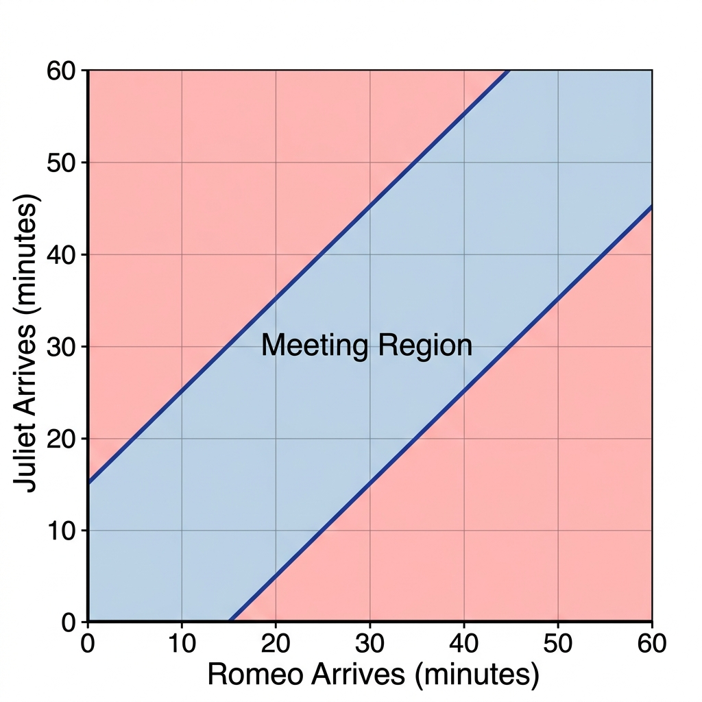

# Abstrak

Laporan ini menganalisis teka-teki probabilitas klasik yang sering digunakan dalam proses rekrutmen *Quantitative Analyst*. Penelitian ini berfokus pada sinkronisasi waktu kedatangan dua individu dalam jendela waktu satu jam dengan batasan waktu tunggu tertentu. Menggunakan pendekatan geometris, kami membuktikan bahwa probabilitas pertemuan adalah 43,75%.

# Pernyataan Masalah

Diberikan sebuah skenario di mana Romeo dan Juliet sepakat untuk bertemu dalam rentang waktu pukul 08:00 hingga 09:00. Aturan kedatangan adalah sebagai berikut:
1. Kedatangan masing-masing bersifat acak dan berdistribusi seragam (*uniformly distributed*) pada interval $[0, 60]$ menit.
2. Setiap individu hanya bersedia menunggu selama 15 menit setelah kedatangan mereka sebelum meninggalkan lokasi.

Tujuan analisis ini adalah menentukan probabilitas bahwa mereka berdua berhasil bertemu.

# Metodologi: Ruang Sampel Geometris

Kita dapat memodelkan waktu kedatangan mereka sebagai variabel acak independen:
- $X$: waktu kedatangan Romeo (menit setelah 08:00), di mana $X \in [0, 60]$.
- $Y$: waktu kedatangan Juliet (menit setelah 08:00), di mana $Y \in [0, 60]$.

Ruang sampel total $S$ adalah persegi di bidang $\mathbb{R}^2$ dengan luas:
$$\text{Area}(S) = 60 \times 60 = 3600$$

Kondisi agar pertemuan terjadi adalah selisih absolut waktu kedatangan mereka tidak melebihi jendela tunggu:
$$|X - Y| \le 15$$

# Derivasi Matematis

Ketidaksamaan $|X - Y| \le 15$ dapat diurai menjadi dua kondisi linear:
1. $Y \le X + 15$
2. $Y \ge X - 15$

Nilai probabilitas $P$ dihitung dengan rasio luas area pertemuan terhadap luas total:
$$P(\text{Bertemu}) = \frac{\text{Area}(\text{Pertemuan})}{\text{Area}(\text{Total})}$$

## Pendekatan Area Komplemen
Perhitungan area pertemuan lebih efisien jika dilakukan dengan menghitung area **tidak bertemu** ($R^c$) terlebih dahulu:
$R^c$ terjadi jika $Y > X + 15$ atau $X > Y + 15$.

Dua wilayah ini membentuk dua segitiga siku-siku identik di sudut persegi.
Panjang sisi masing-masing segitiga adalah $60 - 15 = 45$ unit.

$$\text{Area}(R^c) = 2 \times \left( \frac{1}{2} \times 45 \times 45 \right) = 45^2 = 2025$$

Maka, luas area pertemuan adalah:
$$\text{Area}(R) = 3600 - 2025 = 1575$$

# Hasil Visualisasi

Gambar di bawah ini mengilustrasikan ruang probabilitas tersebut. Area berwarna biru mewakili semua kombinasi waktu kedatangan di mana pertemuan terjadi.



# Kesimpulan

Berdasarkan analisis geometris di atas, probabilitas pertemuan Romeo dan Juliet dapat dirumuskan sebagai:
$$P = \frac{1575}{3600} = \frac{7}{16} = 0.4375$$

Sehingga, secara statistik terdapat peluang sebesar **43,75%** bagi keduanya untuk bertemu dalam kondisi yang telah ditentukan. Hasil ini konsisten dengan ekspektasi teoritis untuk distribusi seragam independen dalam domain kontinu.

\pagebreak

# Lampiran: Implementasi Algoritma

Meskipun visualisasi di atas bersifat statis untuk kompatibilitas lingkungan tanpa Jupyter, logika grafis tersebut dapat direproduksi menggunakan Python dan Matplotlib sebagai berikut:

```python
import matplotlib.pyplot as plt
import numpy as np

def generate_probability_plot():
    fig, ax = plt.subplots(figsize=(7, 7))
    ax.set_aspect('equal')
    ax.set_xlim(0, 60)
    ax.set_ylim(0, 60)
    
    x = np.linspace(0, 60, 500)
    y_upper = np.minimum(x + 15, 60)
    y_lower = np.maximum(x - 15, 0)
    
    ax.fill_between(x, y_upper, y_lower, color='#3498db', alpha=0.3, label='Meeting Region')
    ax.fill_between(x, y_upper, 60, color='#e74c3c', alpha=0.1, label='No Meeting')
    ax.fill_between(x, 0, y_lower, color='#e74c3c', alpha=0.1)
    
    ax.set_xlabel('Romeo Arrival (Minutes past 8:00)')
    ax.set_ylabel('Juliet Arrival (Minutes past 8:00)')
    ax.legend(loc='upper left')
    plt.grid(True, linestyle='--', alpha=0.7)
    plt.savefig('romeo_juliet_plot.png', dpi=300)

if __name__ == "__main__":
    generate_probability_plot()
```
