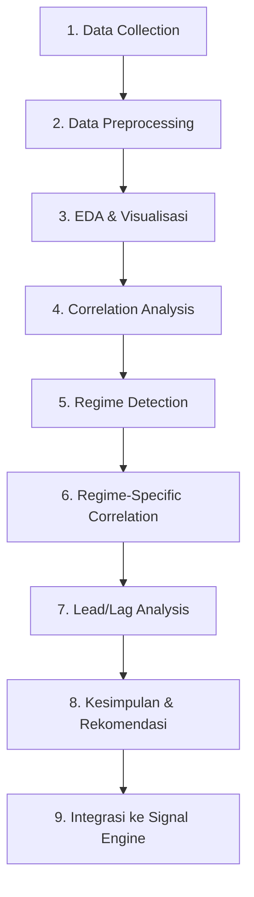

# 📊 Implementation Plan: Correlation Analysis — BTC vs Altcoins

## Konteks

Riset ini bertujuan mengukur korelasi harga BTC terhadap altcoin (ETH, DOGE, LINK, SOL, BNB) untuk dijadikan **fitur tambahan pada signal engine BTC-QUANT**. Jika korelasi kuat & stabil → sinyal BTC bisa diperkuat/divalidasi oleh pergerakan altcoin yang lebih dulu bergerak (lead signal).

---

## 🧠 Alur Berpikir Riset



---

## Phase 1: Data Collection
**Goal:** Ambil data OHLCV historis dari Binance API

| Item | Detail |
|------|--------|
| Pairs | BTC/USDT, ETH/USDT, DOGE/USDT, LINK/USDT, SOL/USDT, BNB/USDT |
| Timeframe | 4H dan 1D |
| Periode | Jan 2022 – Mar 2026 |
| Source | Binance REST API (`/api/v3/klines`) |
| Output | CSV per pair per timeframe di `data/raw/` |

**Kenapa 4H & 1D?**
- 1D → melihat korelasi jangka menengah/panjang (regime-level)
- 4H → melihat korelasi intraday, lebih relevan untuk scalping signal

**Script:** `scripts/01_fetch_data.py`

---

## Phase 2: Data Preprocessing
**Goal:** Bersihkan & sejajarkan data agar siap analisis

Langkah-langkah:
1. Load semua CSV, parse timestamp → datetime index
2. Align semua pair ke timestamp yang sama (inner join)
3. Handle missing values (forward fill, max 1-2 candle)
4. Hitung **returns** — ini yang dikorelasikan, bukan harga mentah:
   - `pct_change()` → simple returns
   - `np.log(close/close.shift(1))` → log returns (lebih baik secara statistik)
5. Simpan ke `data/processed/`

> [!IMPORTANT]
> **Mengapa pakai returns, bukan harga?**
> Harga BTC ($85K) vs DOGE ($0.17) tidak bisa langsung dikorelasikan — skalanya berbeda.
> Returns (% perubahan) menormalisasi skala → korelasi jadi meaningful.
> Jika pakai harga mentah → spurious correlation (dua aset yang naik terus terlihat berkorelasi meski tidak related).

**Script:** `scripts/02_preprocess.py`

---

## Phase 3: Exploratory Data Analysis (EDA)
**Goal:** Pahami karakteristik data sebelum analisis mendalam

Visualisasi yang dihasilkan:
1. **Normalized Price Chart** — semua aset di 1 grafik (base 100) → lihat tren relatif
2. **Returns Distribution** — histogram + stats (mean, std, skewness, kurtosis)
3. **Volatility Comparison** — rolling std dev per aset → identifikasi periode volatile
4. **Heatmap Korelasi Statis** — snapshot awal korelasi antar semua pair

**Output:** `notebooks/01_eda.ipynb` atau `reports/01_eda.md`

---

## Phase 4: Correlation Analysis (Inti Riset)
**Goal:** Ukur korelasi secara komprehensif

### 4a. Static Correlation
- **Pearson** → korelasi linear (dominan dipakai)
- **Spearman** → rank-based (robust terhadap outlier)
- Matrix korelasi untuk seluruh periode

### 4b. Rolling Correlation (Time-Varying)
- Window: 30D, 60D, 90D
- Plot rolling correlation BTC↔ETH, BTC↔DOGE, dst.
- **Insight kunci:** Apakah korelasi stabil atau berubah-ubah?

### 4c. Conditional Correlation
- Korelasi saat BTC naik vs saat BTC turun
- Sering terjadi: korelasi naik drastis saat crash (semua turun bareng)
- Ini penting untuk risk management

**Script:** `scripts/03_correlation.py`

---

## Phase 5: Regime Detection
**Goal:** Identifikasi periode bull/bear/sideways secara otomatis

Metode yang digunakan:
1. **Moving Average Regime** (simpel & efektif):
   - Bull: Price > SMA50 & SMA50 > SMA200
   - Bear: Price < SMA50 & SMA50 < SMA200
   - Sideways: sisanya
2. **Volatility Regime** (opsional):
   - High vol vs low vol menggunakan rolling std dev
3. **Hidden Markov Model** (advanced, opsional):
   - Deteksi regime secara probabilistik

**Script:** `scripts/04_regime_detection.py`

---

## Phase 6: Regime-Specific Correlation
**Goal:** Apakah korelasi BTC-altcoin berubah tergantung kondisi pasar?

Analisis:
| Regime | Ekspektasi |
|--------|-----------|
| Bull | Korelasi moderate — altcoin punya momentum sendiri |
| Bear | Korelasi tinggi — semua jatuh bareng (flight to safety) |
| Sideways | Korelasi rendah — masing-masing bergerak random |

**Ini insight paling berharga:** Jika kita tahu regime saat ini, kita bisa adjust seberapa besar bobot sinyal dari korelasi altcoin.

**Script:** `scripts/05_regime_correlation.py`

---

## Phase 7: Lead/Lag Analysis
**Goal:** Aset mana yang bergerak duluan? → Potensi sebagai leading indicator

Metode:
1. **Cross-Correlation Function (CCF)**
   - Geser salah satu time series ±N lag
   - Lihat di lag mana korelasi paling tinggi
   - Jika ETH dengan lag -2 punya korelasi tertinggi vs BTC → ETH lead 2 candle
2. **Granger Causality Test**
   - Uji statistik: apakah X membantu memprediksi Y?
   - H0: X tidak Granger-cause Y

**Potensi Temuan:**
- ETH sering bergerak **bersamaan** atau **sedikit lag** terhadap BTC
- DOGE kadang bergerak duluan karena retail sentiment
- Result ini bisa jadi **fitur tambahan** di signal engine

**Script:** `scripts/06_lead_lag.py`

---

## Phase 8: Kesimpulan & Report
**Goal:** Rangkum semua temuan menjadi dokumen yang actionable

Isi report:
1. Summary korelasi per pair
2. Stabilitas korelasi (apakah bisa diandalkan?)
3. Regime-specific behavior
4. Lead/lag findings
5. **Rekomendasi: pair mana yang paling berguna sebagai signal enhancer?**

**Output:** `reports/correlation_report.md`

---

## Phase 9: Integrasi ke Signal Engine (Future)
**Goal:** Terjemahkan temuan riset jadi fitur di BTC-QUANT

Potensi implementasi:
1. **Correlation Filter** — Hanya ambil sinyal BTC jika dikonfirmasi oleh altcoin berkorelasi tinggi
2. **Leading Indicator** — Jika ETH sudah mulai bergerak, antisipasi BTC akan follow
3. **Regime-Aware Weight** — Adjust signal confidence berdasarkan regime saat ini
4. **Divergence Alert** — Jika BTC dan ETH biasanya berkorelasi tapi tiba-tiba diverge → warning sign

---

## 📋 Deliverables & Urutan Pengerjaan

| # | Deliverable | File | Estimasi |
|---|------------|------|----------|
| 1 | Fetch data script | `scripts/01_fetch_data.py` | ⬜ Phase 1 |
| 2 | Preprocessing script | `scripts/02_preprocess.py` | ⬜ Phase 2 |
| 3 | EDA notebook/report | `notebooks/01_eda.ipynb` | ⬜ Phase 3 |
| 4 | Correlation script | `scripts/03_correlation.py` | ⬜ Phase 4 |
| 5 | Regime detection | `scripts/04_regime_detection.py` | ⬜ Phase 5 |
| 6 | Regime correlation | `scripts/05_regime_correlation.py` | ⬜ Phase 6 |
| 7 | Lead/lag analysis | `scripts/06_lead_lag.py` | ⬜ Phase 7 |
| 8 | Final report | `reports/correlation_report.md` | ⬜ Phase 8 |

---

## 🔧 Dependencies

```
pandas
numpy
matplotlib
seaborn
scipy (untuk stats tests)
statsmodels (untuk Granger causality)
requests (untuk Binance API)
```

> [!TIP]
> Semua script di-design **modular** — setiap phase menghasilkan output file yang menjadi input phase berikutnya. Ini memungkinkan re-run parsial tanpa harus ulang dari awal.
