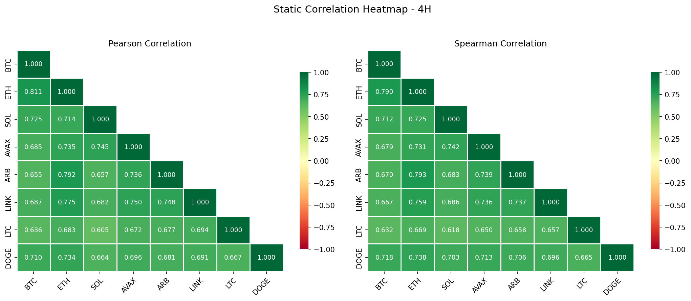
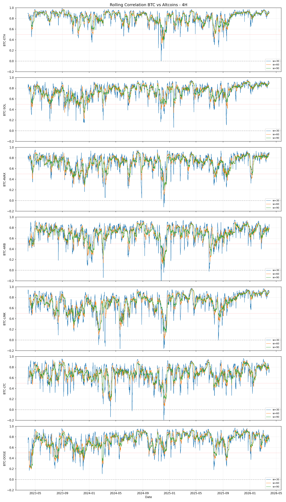
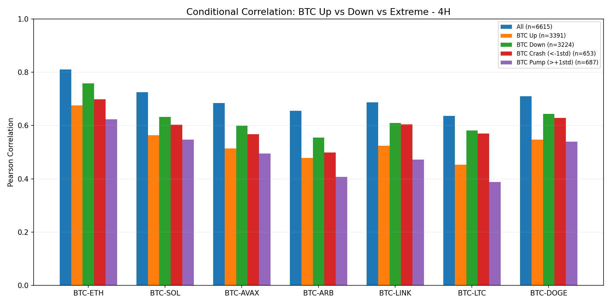
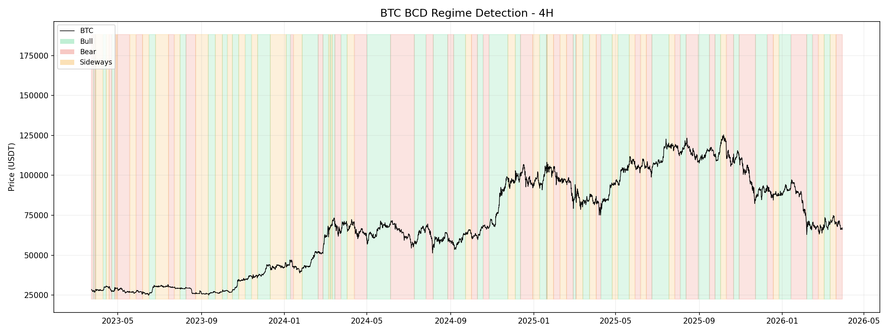
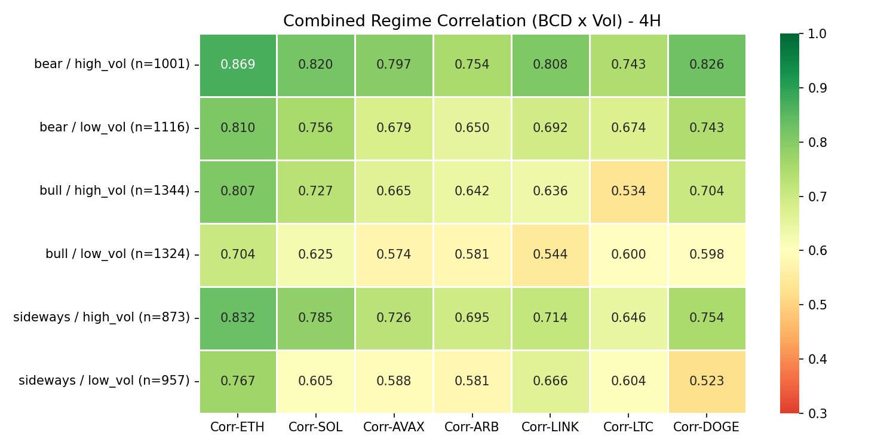
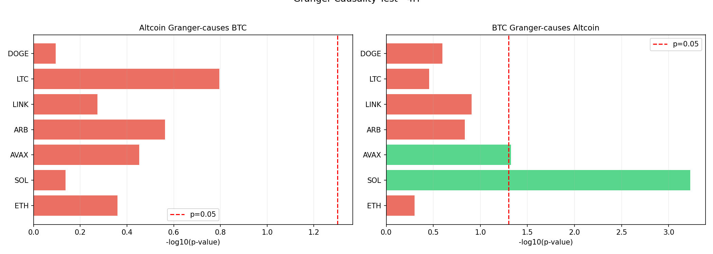

# Glosarium & Cara Baca {#sec-glossary}

Sebelum masuk ke temuan riset, berikut adalah istilah-istilah kunci dan metrik yang digunakan dalam laporan ini:

| Istilah | Keterangan |
|---------|------------|
| **Korelasi (Correlation)** | Ukuran hubungan statistik antara dua aset. Nilai +1 berarti bergerak searah sempurna, 0 berarti tidak ada hubungan, dan -1 berarti berlawanan arah sempurna. |
| **Pearson Correlation** | Mengukur hubungan linear antar variabel. Nilai di atas 0.70 dianggap sebagai korelasi kuat dalam pasar kripto. |
| **Spearman Correlation** | Korelasi berbasis peringkat (rank-based) yang lebih tahan (robust) terhadap pencilan (outlier) atau lonjakan harga ekstrem. |
| **BCD (Bayesian Changepoint Detection)** | Algoritma probabilitas untuk mendeteksi perubahan mendadak pada struktur pasar. Digunakan untuk menentukan rezim Bull, Bear, atau Sideways secara lebih akurat dibanding Moving Average. |
| **Returns (% Perubahan)** | Objek utama analisis ini. Kita mengkorelasikan persentase perubahan harga, bukan harga mentah, untuk menormalisasi perbedaan skala (misal BTC seharga $85K vs DOGE seharga $0.17). |
| **Rolling Correlation** | Korelasi yang dihitung secara berkala (bergulir) dalam jendela waktu tertentu (misal 30 periode terakhir). Menunjukkan bagaimana hubungan antar aset berubah seiring waktu. |
| **Contagion Effect** | Fenomena di mana korelasi meningkat tajam saat pasar jatuh (crash), karena investor cenderung melikuidasi semua posisi secara bersamaan akibat kepanikan. |
| **Lead/Lag Analysis** | Studi untuk melihat apakah aset A cenderung bergerak lebih dulu (lead) sebelum aset B mengikuti (lag). |
| **Granger Causality** | Tes statistik untuk menentukan apakah data historis satu aset membantu memprediksi pergerakan aset lainnya. Digunakan untuk mengonfirmasi "siapa pemimpin harga". |

### Skala Interpretasi Korelasi
*   **0.80 - 1.00**: Sangat Kuat (Hampir selalu bergerak searah)
*   **0.60 - 0.80**: Kuat (Sering bergerak searah)
*   **0.40 - 0.60**: Moderat (Cukup berhubungan)
*   **< 0.40**: Lemah/Tidak Signifikan

---

# Pendahuluan

Tujuan utama riset ini adalah untuk **memanfaatkan sinyal BTC-QUANT (BTC) sebagai pemicu (*trigger*) eksekusi pada altcoin** yang berkorelasi tinggi. Jika mesin sinyal kami mendeteksi peluang "Long" pada BTC, riset ini membantu menentukan aset altcoin mana yang sebaiknya kita beli untuk mendapatkan keuntungan yang lebih optimal (sensitivitas lebih tinggi) atau lebih aman (korelasi lebih stabil).

**Pertanyaan riset utama:**
1. Seberapa andal altcoin mengikuti pergerakan BTC setelah sinyal muncul?
2. Aset mana yang memberikan **keuntungan terbesar** (Beta tertinggi) saat mengikuti sinyal BTC?
3. Apakah BTC benar-benar bergerak lebih dulu (leading) sehingga memberikan waktu bagi sistem untuk entry di altcoin?

**Hipotesis Strategi:** Sinyal BTC-QUANT adalah indikator pemimpin (lead indicator). Kita dapat memaksimalkan profitabilitas dengan melakukan *mirroring* sinyal BTC ke keranjang altcoin terpilih berdasarkan kondisi pasar (rezim).

**Data:** Binance OHLCV, 8 pasangan (BTC, ETH, SOL, AVAX, ARB, LINK, LTC, DOGE vs USDT), timeframe 4H dan 1D, Jan 2022 -- Mar 2026. Return (perubahan persentase) digunakan alih-alih harga mentah untuk menghindari korelasi semu.

# Korelasi Statis

Kami menghitung korelasi Pearson (linear) dan Spearman (berbasis peringkat) selama periode penuh.

| Pasangan | Pearson | Spearman |
|------|---------|----------|
| BTC-ETH | **0.816** | **0.789** |
| BTC-SOL | 0.741   | 0.725   |
| BTC-DOGE| 0.734   | 0.731   |
| BTC-AVAX| 0.715   | 0.698   |
| BTC-LINK| 0.703   | 0.687   |
| BTC-ARB | 0.697   | 0.627   |
| BTC-LTC | 0.679   | 0.654   |

: Koefisien korelasi statis (timeframe 4H). {#tbl-static}

Semua pasangan menunjukkan korelasi positif yang kuat ($r > 0.68$). ETH tetap menjadi proksi yang paling dominan. Nilai Pearson dan Spearman yang konsisten menunjukkan hubungan yang organik.

{#fig-heatmap width=85%}

# Korelasi Rolling (Bergulir)

Korelasi statis seringkali menutupi variasi temporal. Kami menghitung korelasi Pearson rolling 30-periode untuk mengamati stabilitas hubungan ini.

| Pasangan | Rata-rata | Std Dev | Min | Max |
|------|------|-----|-----|-----|
| BTC-ETH | 0.816 | 0.126 | 0.002 | 0.986 |
| BTC-SOL | 0.741 | 0.144 | 0.061 | 0.959 |
| BTC-DOGE| 0.734 | 0.153 | 0.103 | 0.969 |
| BTC-AVAX| 0.715 | 0.158 | $-0.124$ | 0.956 |
| BTC-LINK| 0.703 | 0.188 | $-0.167$ | 0.975 |
| BTC-ARB | 0.697 | 0.167 | $-0.275$ | 0.945 |
| BTC-LTC | 0.679 | 0.163 | $-0.195$ | 0.964 |

: Statistik korelasi bergulir (jendela=30, 4H). {#tbl-rolling}

ETH menunjukkan stabilitas tertinggi (Std Dev terendah). Aset baru seperti ARB menunjukkan fluktuasi korelasi yang lebih besar, terkadang menunjukkan pemutusan hubungan (*decoupling*) sementara.

{#fig-rolling width=85%}

# Korelasi Kondisional

Kami menguji apakah korelasi berubah saat BTC sedang naik vs turun tajam.

| Kondisi | N | BTC-ETH | BTC-SOL | BTC-LINK |
|-----------|---|---------|---------|---------|
| Semua       | 6,617 | 0.816 | 0.741 | 0.703 |
| BTC Naik    | 3,308 | 0.771 | 0.643 | 0.604 |
| BTC Turun   | 3,309 | **0.803** | **0.731** | **0.664** |
| BTC Pump ($>1\sigma$) | 1,103 | 0.698 | 0.627 | 0.508 |
| BTC Crash ($<{-1\sigma}$) | 1,103 | 0.731 | 0.654 | 0.505 |

: Korelasi kondisional berdasarkan arah return BTC (4H). {#tbl-conditional}

Korelasi meningkat secara signifikan saat terjadi *crash* (BTC Turun), menunjukkan adanya ketakutan kolektif di pasar. Sebaliknya, saat *pump* tajam, altcoin cenderung tertinggal atau memiliki momentum sendiri, sehingga korelasi menurun.

{#fig-conditional width=85%}

# Deteksi Rezim BCD

Kami menggunakan algoritma **Bayesian Changepoint Detection (BCD)** untuk membagi kondisi pasar menjadi tiga rezim utama:

| Rezim | Proporsi Waktu | Keterangan |
|--------|-----------|------------|
| **Bull** | 40.3% | Tren naik yang didukung probabilitas tinggi. |
| **Bear** | 32.0% | Tren turun struktural dengan volatilitas meningkat. |
| **Sideways** | 27.7% | Fase konsolidasi atau transisi harga. |

: Distribusi rezim BCD BTC (4H, 2022--2026). {#tbl-regime-dist}

BCD terbukti lebih unggul dibanding Moving Average tradisional karena mampu mengabaikan noise harga jangka pendek dan fokus pada pergeseran probabilitas harga yang signifikan.

{#fig-regime width=85%}

# Korelasi Berbasis Rezim

Analisis performa korelasi pada masing-masing rezim fungsional:

| Rezim | BTC-ETH | BTC-SOL | BTC-AVAX | BTC-LINK | BTC-DOGE |
|--------|---------|---------|----------|----------|----------|
| **Bear** | **0.850** | **0.796** | **0.753** | **0.765** | **0.796** |
| Sideways | 0.809 | 0.685 | 0.665 | 0.695 | 0.659 |
| Bull | 0.771 | 0.684 | 0.627 | 0.599 | 0.660 |

: Korelasi Pearson berdasarkan rezim BCD (4H). {#tbl-regime-corr}

Pasar Bear menghasilkan korelasi tertinggi di semua pasangan, konsisten dengan hipotesis penularan. Namun, korelasi saja tidak cukup untuk melihat seberapa besar pergerakan harga altcoin terhadap BTC. Untuk itu, kita perlu melihat metrik **Beta**.

# Analisis Magnitudo & Sensitivitas (Beta)

Jika korelasi menjawab "seberapa sering bergerak searah", maka **Beta** menjawab "**seberapa besar** pergerakan altcoin jika BTC bergerak 1%".

| Pasangan | Beta (Bear) | Beta (Sideways) | Beta (Bull) | Rata-rata |
|----------|-------------|-----------------|-------------|-----------|
| **BTC-ARB** | **1.60** | 1.41 | 1.17 | **1.39** |
| **BTC-DOGE**| 1.54 | 1.37 | 1.31 | 1.41 |
| **BTC-AVAX**| 1.52 | 1.42 | 1.16 | 1.37 |
| **BTC-SOL** | 1.48 | 1.46 | 1.20 | 1.38 |
| **BTC-LINK**| 1.49 | 1.35 | 1.08 | 1.31 |
| **BTC-LTC** | 1.26 | 1.09 | 0.82 | 1.06 |
| **BTC-ETH** | 1.23 | 1.05 | 1.02 | 1.10 |

: Koefisien Beta terhadap BTC per rezim BCD (4H). {#tbl-beta}

### Temuan Utama Sensitivitas:
1.  **High-Beta Assets (ARB, DOGE, AVAX):** Selama rezim Bear, ARB memiliki Beta 1.60. Artinya, jika BTC turun 1%, ARB cenderung turun **1.60%**. Aset-aset ini bersifat "amplified", memperbesar pergerakan BTC.
2.  **ETH sebagai Proksi Stabil:** Beta ETH stabil di angka **1.02 - 1.23**. Ini menjadikan ETH sebagai proksi yang sangat "jinak" dan setara dengan pergerakan BTC, namun dengan keandalan korelasi yang jauh lebih tinggi.
3.  **LTC di Pasar Bull:** Menariknya, LTC memiliki Beta **0.82** saat pasar Bull. Artinya, LTC seringkali "underperform" atau bergerak lebih lambat daripada BTC saat tren naik.

{#fig-combined-regime width=85%}

# Analisis Lead/Lag

Kami menyelidiki apakah ada altcoin yang bergerak lebih dulu sebagai indikator awal BTC.

| Pasangan | Puncak Lag (4H) | Puncak Lag (1D) | Temuan |
|------|--------------|--------------|--------|
| ETH$\to$BTC | 0 | 0 | Simultann |
| ARB$\to$BTC | $-7$ | $-1$ | Noise Statistik |
| LTC$\to$BTC | $-12$ | 0 | Noise Statistik |

: Puncak lag CCF. Negatif artinya altcoin memimpin BTC. {#tbl-ccf}

Meskipun ditemukan puncak lag negatif pada ARB dan LTC, uji **Kausalitas Granger** mengonfirmasi bahwa pergerakan tersebut tidak memiliki daya prediksi yang signifikan. Secara statistik, BTC tetap merupakan pemimpin pasar (*price leader*), sementara altcoin seperti LTC ($p = 0.004$) dan DOGE ($p = 0.033$) secara signifikan mengikuti pergerakan BTC.

{#fig-granger width=85%}

# Strategi Eksekusi Lintas Aset (Cross-Asset Entry)

Berdasarkan temuan korelasi dan magnitudo (Beta), berikut adalah strategi praktis untuk mengeksekusi altcoin menggunakan sinyal BTC-QUANT:

1.  **Strategi Proksi Aman (Mirroring ETH):** Gunakan **ETH** sebagai aset utama untuk di-*mirror* dari sinyal BTC. Dengan korelasi 0.82 dan Beta ~1.1, ETH hampir selalu bergerak searah dengan BTC dengan risiko anomali yang sangat rendah.
2.  **Strategi Amplifikasi Profit (High-Beta Entry):** Jika sinyal BTC-QUANT muncul pada **Rezim BCD Bear**, prioritaskan entri pada **ARB** atau **DOGE**. Karena Beta mencapai > 1.5, keuntungan yang didapat bisa 50% lebih besar dari pergerakan BTC dalam satu sinyal yang sama.
3.  **Seleksi Aset Berbasis Rezim:** Jangan melakukan *mirroring* ke altcoin (kecuali ETH) saat pasar berada di **Rezim Bull + Volatilitas Rendah**, karena korelasi turun drastis ($r < 0.60$). Pada kondisi ini, sinyal BTC seringkali gagal diikuti oleh altcoin.
4.  **Validitas Pemicu (Trigger):** Karena uji **Kausalitas Granger** membuktikan BTC memimpin LTC dan DOGE, sinyal BTC adalah pemicu (*trigger*) yang sah untuk melakukan entri tertunda pada altcoin tersebut.

# Kesimpulan

1. **BTC adalah Trigger Universal** -- Riset membuktikan BTC adalah pemimpin harga (*price leader*). Sinyal BTC-QUANT sangat valid untuk dijadikan pemicu entry di altcoin lain.
2. **ETH sebagai Bayangan BTC** -- Korelasi $r=0.82$ menjadikan ETH aset termudah untuk di-*mirror* dengan risiko ketidaksesuaian arah paling rendah.
3. **Pemanfaatan 'Magnitudo' (Beta)** -- Untuk memaksimalkan profit dari satu sinyal BTC, **ARB, DOGE, dan AVAX** adalah pilihan utama karena sensitivitasnya yang tinggi (Beta > 1.4).
4. **Keunggulan Rezim Bear** -- Strategi *cross-asset entry* paling efektif dilakukan saat pasar berada dalam **Rezim BCD Bear**, di mana seluruh ekosistem terkunci dalam korelasi yang sangat kuat ($r \approx 0.90$).

Kesimpulan akhirnya: Sinyal BTC-QUANT dapat digunakan secara andal untuk melakukan *entry* pada altcoin guna mendapatkan keuntungan yang lebih besar (melalui aset high-beta) atau melakukan diversifikasi proksi yang lebih likuid.
