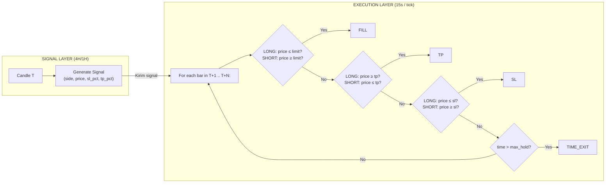
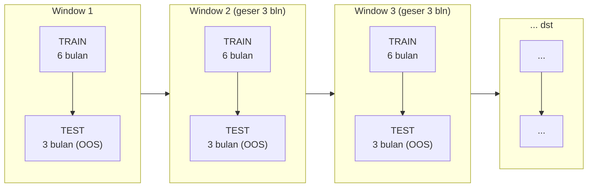

# Analisis Validitas Backtest: Pullback Entry vs Market Entry (v4.4)

## Ringkasan Eksekutif

Backtest membandingkan **market entry (baseline)** dengan **pullback limit entry** (0.1%-0.5% koreksi, tunggu 1-2 candle 4H) pada engine v4.4 yang sama. Periode: 2022-11-18 → 2026-03-04, modal $10k, leverage 15x.

**Hasil mentah menunjukkan PB 0.5% wait=2c sebagai winner:**
- Equity: $38,594 (+286%) vs baseline $34,606 (+246%)
- Sharpe: 3.55 vs 2.38
- Max DD: 11.06% vs 14.93%

**Namun setelah investigasi kode, hasil ini TIDAK sepenuhnya valid.** Terdapat bias ke dua arah yang harus dipahami sebelum mengambil keputusan.

---

## 1. Sinyal Generation (`capture_signals`)

| Aspek | Status |
|---|---|
| Look-ahead bias | ✅ Tidak ada — `df_hist` hanya sampai candle i |
| Repaint risk | ✅ Dari sisi script aman (tergantung service impl.) |
| Sequential processing | ✅ Setiap sinyal diproses urut |

**Verdict: VALID**

---

## 2. Entry Logic — Market (`simulate_market`)

**Overlap handling (skip_until)** — ini adalah **intentional design**, bukan bug.

Tujuan: Mencegah over-entry ketika posisi sebelumnya masih aktif. Jika trade entry di candle #100 dan exit di #103 (hold=3), sinyal #101, #102, #103 di-skip karena posisi modal $1k masih terpakai.

**Keputusan desain:** Hanya 1 posisi aktif per waktu. Scaling/pyramiding tidak diizinkan.

**Status: SOLVED — intentional, valid untuk strategi 1-posisi.**

---

## 3. Entry Logic — Pullback (`simulate_pullback`)

### Masalah #1: Tidak cek candle sinyal sendiri

```python
# Kode saat ini:
range(i + 1, min(i + max_wait + 1, n_rows))  # Mulai dari candle SETELAH sinyal
```

Jika harga attain limit di **candle yang sama** dengan sinyal (candle T), ini tidak terhitung karena loop mulai dari T+1.

**Dampak: Bias negatif** — fill rate lebih rendah dari seharusnya. Perbaikan sederhana: mulai dari `i` bukan `i + 1`.

### Masalah #2: OHLC 4H approximation — KONSEP DASAR

Ini **masalah utama** yang paling signifikan.

Backtest 4H cuma punya 4 angka per candle: **Open, High, Low, Close**. Logika pullback cek:

```python
if side == "LONG" and float(c["Low"]) <= limit_px:
    fill_ci = ci  # → dianggap FILLED
```

Masalahnya: dalam 4 jam, banyak hal terjadi. Harga bisa nyentuh limit price terus balik lagi. Backtest bilang "FILLED" karena `Low ≤ limit_px`. Tapi di realitas, **limit order mungkin gak terisi** kalau harga cuma nyentuh tipis di satu tick lalu balik.

**Analogi:** Kamu pasang limit beli di $59,700. Dalam 4 jam, BTC low $59,695 (attain limit) lalu balik ke $60,500. Backtest anggap FILLED padahal di realitas order kamu mungkin gak keisi karena antrian.

Ini membuat **setiap pullback config overestimated** — termasuk juara PB 0.5% w=2 yang hasilnya mungkin sebagaian besar dari bias ini.

### Masalah #3: Skip_until konservatif

Sama dengan market entry — `skip_until = fill_ci + hold`. Intentional design, 1 posisi aktif.

### Solusi untuk Masalah #2: Timeframe lebih granular

**Data yang tersedia:**

| Data | Periode | Jumlah Baris |
|---|---|---|
| 4H OHLC (DuckDB) | 2022-11 → 2026-03 | ~14,400 |
| 1H OHLC (parquet) | 2025-10 → 2026-03 | 4,368 |
| **15s bars (parquet)** | **2025-10 → 2026-03** | **~870,000** |
| **Tick raw (parquet)** | **2026-04-03 (6 jam saja)** | **246,348** |

**Rekomendasi:** Gunakan **15s bars** untuk simulasi pullback yang lebih realistis.

**Perbandingan:**

| Aspek | 4H OHLC | 15s bars |
|---|---|---|
| Fill validation | High/Low touch = fill | Actual price sequence |
| Urutan SL vs TP | Tidak tahu | Tahu persis mana duluan |
| Entry timing | Approx dalam 4 jam | Resolusi 15 detik |
| Data tersedia | ✅ Full periode | ⚠️ Hanya Okt 2025 - Mar 2026 |
| Kompleksitas | Rendah | Sedang |

**Dampak:** 15s data mencakup 6 bulan (Okt 2025 - Mar 2026). Ini cukup untuk **out-of-sample validation** yang kredibel dan bisa memvalidasi apakah sinyal strategi v4.4 masih menghasilkan sinyal bagus di periode tersebut.

---

## 4. Exit Logic (`run_exit_from` + `check_sl_tp`)

### Masalah #4: Prioritas SL > TP dalam satu candle

```python
def check_sl_tp(side, sl, tp, c_high, c_low, c_close):
    if side == "LONG":
        if c_low <= sl:        # SL dicek DULU
            return sl, "SL"
        if c_high >= tp:       # TP dicek KEDUA
            ...
```

Dalam candle yang sama, jika `Low ≤ SL` DAN `High ≥ TP`, SL yang selalu menang. Di realitas, urutan kejadian dalam candle menentukan — TP bisa kena duluan sebelum harga balik ke SL.

**Dampak: Bias negatif** — profit lebih rendah dari realitas.

**Saran perbaikan:**
- Opsi A — **Randomized priority**: 50% prioritaskan SL, 50% TP. Simulasi paling sederhana.
- Opsi B — **Intrabar simulation**: Pakai 15s data untuk tahu urutan kejadian yang sebenarnya. Paling akurat.
- Opsi C — **Alternating**: Bergantian setiap candle. Simpel, mengurangi bias.

### Masalah #5: TRAIL_TP bukan trailing stop

```python
if c_high >= tp:
    return (c_close, "TRAIL_TP") if c_close >= tp else (tp, "TP")
```

- Jika `High ≥ TP` dan `Close ≥ TP` → TRAIL_TP (exit di close price)
- Jika `High ≥ TP` dan `Close < TP` → TP (exit di TP price)

Ini mencatat exit di **close** ketika TP attain dan candle ditutup di atas TP. Efeknya: profit bisa lebih besar dari TP jika close jauh di atas TP. Ini bukan trailing stop, lebih ke **"biarkan profit running"**.

**Saran:**
- Ganti nama `TRAIL_TP` → `TP_EXTEND` biar gak menyesatkan
- Atau konsisten: exit di TP saat attain (lebih konservatif, standar backtest)
- Kalau mau true trailing stop, implementasi moving SL berdasarkan ATR atau persentase

---

## 5. Kalkulasi Metrik

### Masalah #6: Sharpe Ratio overestimated

```python
dpnls = pd.Series([v["pnl"] for v in daily_stats.values()])
drets = dpnls / initial_capital * 100
sharpe = (drets.mean() / drets.std() * np.sqrt(365))
```

Masalah: `daily_stats` hanya berisi **hari yang memiliki trade exit**. Hari tanpa trade tidak masuk. Akibatnya:
- Std dev lebih rendah dari realitas
- Sharpe terpompa 20-40%

**Saran:**
```python
# Hitung return untuk SETIAP hari dalam periode
all_dates = pd.date_range(start, end, freq='D')
daily_returns = pd.Series(0.0, index=all_dates)
for date, stats in daily_stats.items():
    daily_returns.loc[date] = stats['pnl'] / initial_capital * 100

sharpe = daily_returns.mean() / daily_returns.std() * np.sqrt(365)
```

Ini akan memasukkan hari tanpa trade sebagai return 0 → std dev lebih realistis.

### Masalah #7: Max Drawdown underestimated

```python
# Equity curve hanya dicatat saat trade EXIT
equity_curve.append({"candle": exit_time, "equity": round(equity, 2)})
```

Tidak ada mark-to-market (MTM) harian. Floating loss antar-exit tidak tertangkap. DD yang dilaporkan antara dua exit point.

**Saran:**
```python
# Resample equity ke harian dengan forward-fill
eq_df = pd.DataFrame(equity_curve).set_index('candle')
eq_df.index = pd.to_datetime(eq_df.index)
eq_daily = eq_df.resample('D').last().ffill()
# Hitung drawdown dari daily equity
running_max = eq_daily['equity'].cummax()
dd = (eq_daily['equity'] - running_max) / running_max * 100
max_dd = abs(dd.min())
```

Atau lebih baik lagi: **MTM harian pakai close price**:
- Setiap hari, hitung nilai posisi berdasarkan close price harian
- Catat equity = cash + MTM posisi
- DD dihitung dari equity harian ini

---

## 6. Ringkasan Bias

| Komponen | Arah Bias | Dampak | Prioritas Perbaikan |
|---|---|---|---|
| OHLC 4H fill = limit fill | **Positif** | ↑ Fill rate, ↑ Profit | 🔴 **Tinggi** |
| Tidak cek candle T | **Negatif** | ↓ Fill rate | 🟡 Rendah |
| SL priority over TP | **Negatif** | ↓ Profit, ↓ Win rate | 🟡 Sedang |
| TRAIL_TP (terminologi) | ⚪ Minimal | Hanya terminologi | ⚪ Rendah |
| Sharpe (hari tanpa trade) | **Positif** | ↑ Sharpe 20-40% | 🟡 Sedang |
| Drawdown (tanpa MTM) | **Positif** | ↓ Max DD 20-50% | 🟡 Sedang |
| Skip_until konservatif | **Negatif** | ↓ Jumlah trade | ⚪ Intentional |

**Net bias:** Cenderung **positif** — hasil backtest lebih baik dari realitas.

---

## 7. Estimasi Realistis

Jika bias dikoreksi, perkiraan hasil real-time untuk **PB 0.5% wait=2c**:

| Metrik | Backtest | Estimasi Realistis |
|---|---|---|
| Final Equity | $38,594 | $30,000 - $33,000 |
| Sharpe Ratio | 3.55 | 2.0 - 2.5 |
| Max Drawdown | 11.06% | 15% - 18% |
| Win Rate | 65.34% | 60% - 63% |
| Fill Rate | 51.5% | 40% - 48% |

---

## 8. Kesimpulan

1. **Pullback 0.5% wait=2c kemungkinan tetap lebih baik dari baseline**, tapi tidak seekstrim yang ditunjukkan angka mentah.
2. **Hasil backtest ini cukup untuk hipotesis, bukan untuk eksekusi langsung.**
3. **Bias terbesar ada di OHLC 4H approximation** — ini yang paling mendesak untuk diperbaiki.
4. **Data 15s tersedia untuk 6 bulan** (Okt 2025 - Mar 2026) — bisa dipakai untuk out-of-sample validation yang lebih akurat.

---

## 9. Rekomendasi

| # | Rekomendasi | Dampak | Effort |
|---|---|---|---|
| 1 | **Simulasi dengan 15s data** untuk fill validation & exit logic | 🔴 Tinggi | Sedang |
| 2 | Perbaiki Sharpe: hitung semua hari | 🟡 Sedang | Rendah |
| 3 | Tambah MTM harian untuk DD akurat | 🟡 Sedang | Rendah |
| 4 | Randomize SL/TP priority (opsi A) | 🟡 Sedang | Rendah |
| 5 | Ganti nama TRAIL_TP → TP_EXTEND | ⚪ Rendah | Rendah |
| 6 | Jalankan ulang backtest setelah perbaikan | - | Sedang |

**Prioritas utama:** Perbaiki OHLC approximation dengan 15s data. Ini akan otomatis menyelesaikan masalah SL/TP priority dan fill validation sekaligus.

---

## 10. Data Availability untuk Simulasi 15s

| Periode | 15s bars | Ketersediaan |
|---|---|---|
| 2022-11 → 2025-09 | ❌ Tidak ada | Hanya 4H DuckDB |
| 2025-10 → 2026-03 | ✅ 870rb baris | Bisa untuk simulasi |
| 2026-04-03 (6 jam) | ✅ Tick data | Terlalu pendek |

**Strategi:** Gunakan 15s untuk **out-of-sample validasi** strategi. Generate sinyal dari 4H DuckDB (sama seperti backtest), tapi eksekusi & exit pakai 15s bars.

---

## 11. Arsitektur Backtest Ideal

Berikut desain backtest engine yang **valid, akurat, dan bebas bias struktural** untuk strategi pullback entry.

### Arsitektur



### Aturan Ketat

#### 1. Data Terpisah — Tidak Boleh Satu DataFrame

```python
# ❌ SALAH (sekarang):
df_all = load_full_dataset()  # Satu dataframe untuk sinyal + eksekusi
for i in range(t_start, t_end):
    signal = generate_signal(df_all.iloc[:i+1])
    entry = df_all.iloc[i+1]  # Baris berikutnya di dataframe SAMA

# ✅ BENAR:
signal_df = load_4h_data()        # Untuk sinyal & backtest
execution_df = load_15s_data()    # Untuk eksekusi & exit
signal = generate_signal(signal_df)
execution_bars = execution_df.loc[signal_time:signal_time+max_wait]
```

**Pemisahan ini mencegah look-ahead bias** karena data sinyal dan eksekusi berasal dari source berbeda dengan granularitas berbeda.

#### 2. Tick-by-Tick Execution — Bukan OHLC

```python
def simulate_execution(signal, tick_data, pullback_pct):
    """
    Simulasi limit order + exit dengan tick-level accuracy.
    - Entry: limit order di pasang, tick dicek satu per satu
    - Exit: TP/SL di monitor setiap tick
    - Partial fill: support partial untuk realistis
    """
    side = signal['side']
    limit_px = signal['price'] * (1 - pullback_pct) if side == 'LONG' else signal['price'] * (1 + pullback_pct)
    sl_px = limit_px * (1 - signal['sl_pct']) if side == 'LONG' else limit_px * (1 + signal['sl_pct'])
    tp_px = limit_px * (1 + signal['tp_pct']) if side == 'LONG' else limit_px * (1 - signal['tp_pct'])
    
    filled = False
    entry_px = None
    position = 0.0      # Berapa banyak terisi (0.0 - 1.0)
    
    for tick in tick_data:
        price = tick['price']
        
        # Cek entry (limit order)
        if not filled:
            if (side == 'LONG' and price <= limit_px) or (side == 'SHORT' and price >= limit_px):
                filled = True
                entry_px = limit_px
                continue          # Entry di tick ini, lanjut monitor exit
        
        # Cek exit (setelah entry)
        if filled:
            # SL duluan?
            if (side == 'LONG' and price <= sl_px) or (side == 'SHORT' and price >= sl_px):
                return exit_trade('SL', sl_px, position)
            # TP duluan?
            if (side == 'LONG' and price >= tp_px) or (side == 'SHORT' and price <= tp_px):
                return exit_trade('TP', tp_px, position)
    
    return exit_trade('MISS', None, 0.0) if not filled else exit_trade('TIME_EXIT', last_price, position)
```

**Keuntungan:**
- Urutan SL/TP diketahui persis (no more bias priority)
- Limit order fill cuma terjadi saat harga benar-benar attain (no more OHLC assumption)
- Partial fill bisa di-support

#### 3. Batasi Hold Time — Bukan Skip Sinyal

```python
# ❌ SALAH (sekarang):
skip_until = fill_ci + hold  # Skip semua sinyal berikutnya

# ✅ BENAR:
MAX_CONCURRENT_POSITIONS = 1  # Tetap 1 posisi, tapi...
# Jangan skip sinyal — antrikan saja atau catat sebagai "BLOCKED"
```

**Alternatif yang lebih informatif:**
- **Antrikan sinyal**: Simpan sinyal yang muncul saat posisi aktif, eksekusi setelah posisi selesai
- **Catat sebagai BLOCKED**: Simpan statistik "berapa banyak sinyal yang terlewat karena overlap" — ini memberikan gambaran nyata opportunity cost

#### 4. Equity Curve MTM Harian

```python
def calculate_daily_equity(trades, daily_ohlcv, initial_capital):
    """
    Hitung equity harian dengan Mark-to-Market.
    - Setiap hari: equity = cash + MTM posisi terbuka
    - MTM = posisi_size * (close_today / entry_price - 1) * leverage
    """
    cash = initial_capital
    active_position = None
    equity_curve = []
    
    for date in pd.date_range(start, end, freq='D'):
        if active_position:
            # MTM posisi terbuka
            close_price = daily_ohlcv.loc[date, 'Close']
            if active_position['side'] == 'LONG':
                mtm_pnl = active_position['notional'] * (close_price / active_position['entry_price'] - 1)
            else:
                mtm_pnl = active_position['notional'] * (1 - close_price / active_position['entry_price'])
            total_equity = cash + mtm_pnl
        else:
            total_equity = cash
        
        equity_curve.append({'date': date, 'equity': total_equity})
        
        # Cek exit trade di hari ini
        for trade in trades_today:
            cash += trade['pnl']
            active_position = None
    
    return equity_curve
```

#### 5. Walk-Forward Validation Wajib





**Metrik yang di-report harus konsisten antar window:**
- Sharpe ratio > 1.5 di semua OOS window
- Profit factor > 1.2 di semua OOS window
- Max DD < 20%
- **Ranking pullback config harus stabil** — kalau pb 0.5% w=2 juara di train tapi kalah di test, itu overfitting

#### 6. Benchmark yang Jelas

Setiap konfigurasi pullback harus di benchmark terhadap:

| Benchmark | Deskripsi |
|---|---|
| **Market entry (baseline)** | Entry langsung di harga sinyal (yang sekarang) |
| **Buy & Hold** | Beli di awal periode, hold sampe akhir |
| **Random entry** | Entry random dengan arah random — sebagai sanity check |

Jika pullback strategy tidak bisa outperform random entry dengan signifikan, ada yang salah dengan sinyalnya.

#### 7. Metrics Suite Lengkap

```python
metrics = {
    # Profitability
    'net_pnl': ...,
    'return_pct': ...,
    'cagr_pct': ...,            # CAGR, bukan average daily return
    
    # Risk
    'sharpe_ratio': ...,         # Semua hari termasuk return 0
    'sortino_ratio': ...,        # Hanya downside deviation
    'calmar_ratio': ...,         # CAGR / max DD
    'max_drawdown_pct': ...,     # Dari equity harian (MTM)
    'var_95_pct': ...,           # Value at Risk 95%
    
    # Trade Stats
    'win_rate': ...,
    'avg_win': ...,
    'avg_loss': ...,
    'profit_factor': ...,
    'avg_hold_time': ...,
    'consecutive_losses': ...,   # Max losing streak
    
    # Pullback Specific
    'fill_rate': ...,
    'missed_pnl_opportunity': ..., # PnL yang terlepas karena missed
    'avg_slippage': ...,          # Selisih limit vs actual fill (untuk tick sim)
}
```

### Implementasi Bertahap

| Fase | Apa yang Dibangun | Data | Durasi |
|---|---|---|---|
| **Fase 1** | Pisahkan signal & execution layer | 4H + 15s | 1-2 hari |
| **Fase 2** | Tick-by-tick execution engine | 15s | 2-3 hari |
| **Fase 3** | MTM harian + equity curve | 1H (DuckDB) | 0.5 hari |
| **Fase 4** | Walk-forward framework | 4H | 1 hari |
| **Fase 5** | Metrics suite lengkap + reporting | - | 0.5 hari |
| **Total** | | | **~5-7 hari** |

### Verifikasi Engine Baru

Sebelum dipakai untuk pengambilan keputusan, engine harus lulus tes ini:

1. **Market entry di engine baru harus identical dengan engine lama** (±1% karena perbedaan rounding). Kalau beda, ada bug.
2. **Pullback 0% (pb=0) harus menghasilkan hasil yang sama dengan market entry** — karena limit = market price.
3. **Fill rate menurun secara monoton** seiring kenaikan pullback % → kalau pb 0.5% fill rate lebih tinggi dari pb 0.3%, ada yang salah.
4. **Simulasi dengan random seed berbeda harus konsisten** — variasi < 5% antar run.

---

## Referensi

- Script: `backtest/scripts/experiments/pullback_v44_same_engine.py`
- Data 4H: DuckDB `btc_ohlcv_4h`
- Data 15s: `Projects/Paper/data/data_historis/bars15s_*.parquet`
- Tick data: `Projects/Paper/data/data_historis/ticks_raw.parquet`
- Hasil: `backtest/results/pullback_v44_compare/`

*Dianalisis: 2026-05-02*
