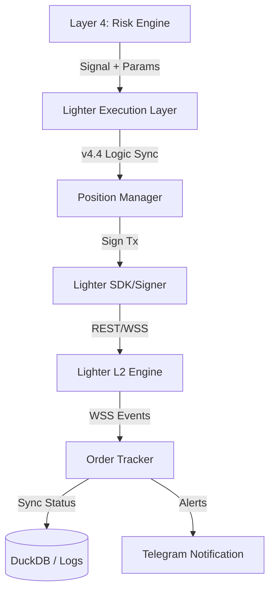

# ⚡ BTC-QUANT: Lighter Execution Layer
## Product Requirements Document (PRD) & Definition of Done (DoD)
### Version 1.1 — March 2026

---

| Field | Detail |
|---|---|
| **Project** | BTC-Quant: Lighter Execution Layer |
| **Version** | v1.1 — Golden Model Alignment |
| **Status** | Finalized — Ready for Phase 1 |
| **Priority** | High — Expansion to L2 DEX |
| **Owner** | Developer |
| **Stack** | Python · Lighter SDK · WebSockets · DuckDB |

---

## 1. Overview

BTC-QUANT saat ini memiliki kemampuan eksekusi di Binance Futures. Dokumen ini merinci kebutuhan teknis untuk membangun "Execution Layer" di **Lighter.xyz** (L2 Orderbook DEX) dengan menyelaraskan seluruh perbaikan dari **v4.4 Golden Model**.

### Tujuan
- Mengintegrasikan sinyal dari **Layer 4 (Risk Engine)** ke dalam eksekusi riil di Lighter.
- Menjamin paritas logika dengan v4.4 (Fix #1, #2, #3).
- Mengelola siklus hidup order di L2 dengan latensi rendah dan manajemen nonce yang handal.

---

## 2. Arsitektur Integrasi

Eksekusi Lighter mengikuti arsitektur modular `live_executor.py` dan disesuaikan untuk L2:

---

## 3. Persyaratan Teknis (Core Requirements)

### R-01: Manajemen Nonce (Critical)
Setiap API Key di Lighter memiliki sistem penomoran transaksi (Nonce) yang harus berurutan.
- **Persistence**: Bot harus melacak `next_nonce` secara persisten.
- **Resync**: Kemampuan untuk melakukan re-fetch nonce dari server Lighter jika terdeteksi mismatch atau setelah reboot.

### R-02: Scaling & Precision (Integer-based)
- **Math Engine**: Konversi `float` ke `scaled integer` (10^decimals).
- **Metadata Sync**: Sinkronisasi dinamis `price_decimals` dan `size_decimals` dari bursa secara berkala.

### R-03: v4.4 Logic Parity
- **L3 Counter-Signal**: Implementasi logika di mana MLP Neutral memberikan beban negatif (-0.3) pada sinyal directional.
- **Exit Strategy**: Mendukung *Trailing Stop* dan *Time Exit (24h)* di infrastruktur L2.

---

## 4. Rencana Pengembangan (Phases)

### Phase 1: API Client & Connectivity 🌐
- [ ] Implementasi `LighterClient` (REST/WSS wrapper).
- [ ] Koneksi Testnet & sinkronisasi metadata market.
- **DoD**: Berhasil fetch balance dan orderbook; WebSocket `Account` stabil.

### Phase 2: Order & Nonce Engine ⚙️
- [ ] Modul `NonceManager` (Local tracking + Server sync).
- [ ] Modul `OrderSigner` (Offline signing via Lighter SDK).
- **DoD**: Berhasil kirim 2 order beruntun (<1s) di Testnet tanpa nonce error.

### Phase 3: Execution & Logic Sync 🧠
- [ ] Integrasi penuh dengan v4.4 Signal Engine.
- [ ] Logika `PositionManager` khusus L2 (Integer math aware).
- **DoD**: Bot mengeksekusi sinyal riil dengan perhitungan size yang akurat.

### Phase 4: Monitoring & Fail-safes 🛡️
- [ ] Log eksekusi berlabel `exchange: lighter`.
- [ ] Telegram alert detail (API Key Index, Scaled Size).
- **DoD**: Sistem recovery otomatis saat koneksi WSS putus.

---

## 5. Definition of Done (DoD) Global

### A. Keakuratan & Presisi
*   [ ] **Integer Scaling Test**: Lulus unit test untuk 5 skenario konversi harga/size berbeda tanpa error pembulatan.
*   [ ] **Dynamic Metadata**: Bot melakukan sinkronisasi decimals dari API minimal sekali dalam 24 jam.

### B. Robustness Nonce Management
*   [ ] **Persistence Check**: Setelah bot di-restart, sinkronisasi nonce berjalan otomatis sebelum transaksi pertama.
*   [ ] **Sequential Execution**: Berhasil mengirim multiple order dalam waktu singkat tanpa kegagalan *nonce mismatch*.

### C. Integrasi Logika v4.4
*   [ ] **Fix #1 Sync**: Verifikasi logika *Counter-Signal* (MLP Neutral) berjalan aktif.
*   [ ] **Exit Manager**: Berhasil mengeksekusi *Trailing Stop* dan *Time Exit (24h)* di bursa Lighter.

### D. Observability & Security
*   [ ] **Telegram Sync**: Notifikasi menyertakan info detail (API Key Index, Scaled Quantity).
*   [ ] **Latency**: Waktu *local signing* transaksi terukur di bawah 100ms.
*   [ ] **Stability**: Uji coba 48 jam di Testnet tanpa intervensi manual dan tanpa kebocoran Private Key di log.

---

*Terakhir diperbarui: Maret 2026 — v1.1 Golden Model Alignment*
