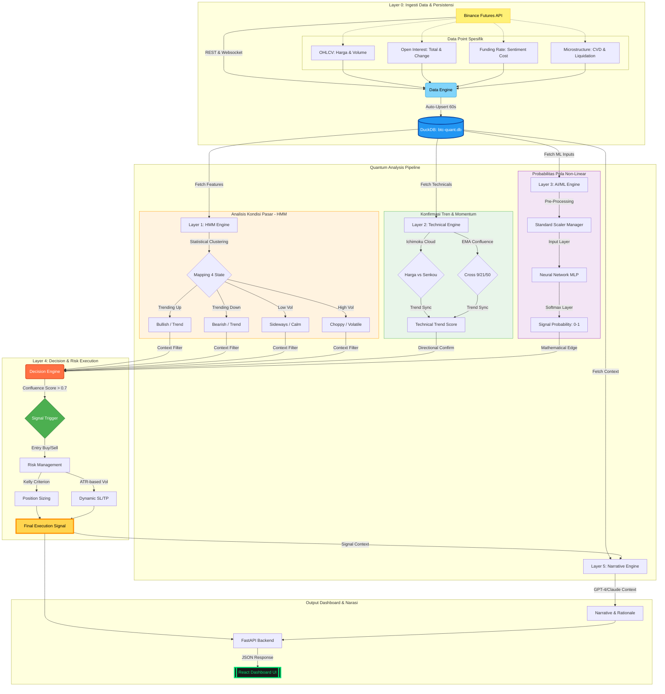

# BTC-QUANT Meta-Konsep & Arsitektur Layer

Dokumen ini menjelaskan struktur tingkat tinggi dari platform **BTC-QUANT** dan bagaimana setiap lapisan (layer) bekerja sama untuk menghasilkan sinyal trading.

## 1. Peta Konsep Arsitektur Komprehensif (Mermaid)

Berikut adalah visualisasi lengkap seluruh ekosistem BTC-QUANT, dari sumber data hingga representasi visual.

---

## 2. Detail Fungsional Setiap Layer

### Layer 1: Market Regime Detection (HMM)
- **Fungsi**: Mesin deteksi kondisi struktural pasar.
- **Input**: Log returns, realized volatility (14), HL candle range, dan **OI Rate of Change**.
- **Algoritma**: *Hidden Markov Model* (HMM) dengan distribusi Gaussian.
- **Output**: 4 State pasar (Bullish, Bearish, Calm, Volatile).
- **Deep Tech**: Menggunakan algoritma **Baum-Welch** untuk estimasi parameter dan **Viterbi** untuk menentukan urutan state paling mungkin. Layer ini krusial karena menentukan parameter risiko di Layer 4.

### Layer 2: Technical Trend Confluence (EMA & Ichimoku)
- **Fungsi**: Konfirmasi arah momentum secara deterministik.
- **Input**: Harga OHLCV.
- **Konfigurasi**:
  *   **EMA Confluence**: Perpotongan EMA 9, 21, dan 50.
  *   **Ichimoku Cloud**: Posisi harga terhadap Senkou Span A/B (Cloud) dan Kijun-Sen.
- **Output**: Technical Score (Aligned vs Not Aligned).

### Layer 3: AI Signal Intelligence (MLP)
- **Fungsi**: Prediksi pola non-linear jangka pendek.
- **Arsitektur**: *Multi-Layer Perceptron* (Neural Network) dengan 2 hidden layers (64x32 atau 128x64).
- **HMM Feature Cross**: Salah satu fitur tercanggih — input HMM dari Layer 1 dimasukkan ke dalam Layer 3 sebagai fitur tambahan (*One-Hot*), menyilangkan konteks regime dengan prediksi harga.
- **Statistik**: Berfungsi sebagai filter probabilitas (Softmax score > 55% untuk konfirmasi).

### Layer 4: Decision Engine & Risk Execution
- **Fungsi**: Agregator keputusan dan manajemen modal.
- **Logika**: Menggabungkan L1 (Konteks), L2 (Momentum), dan L3 (Probabilitas AI) menjadi **Skor Konfluens (0-100)**.
- **Manajemen Risiko**:
  *   **Dynamic SL/TP**: 1.5x ATR dari harga entry.
  *   **Sizing**: Menggunakan perhitungan **Kelly Criterion** disesuaikan dengan volatilitas pasar.
  *   **Leverage**: Dinamis (2x - 7x) bergantung pada rasio ATR/Price.

### Layer 5: Sentiment, Narrative & LLM Synthesis
- **Fungsi**: Penerjemah strategis dan filter psikologi.
- **Model**: LLM (OpenAI/Kimi) dengan *Zero-Shot Chain-of-Thought*.
- **Input Utama**: Menerima data kuantitatif gabungan dari **Layer 4**.
- **Truth Enforcer**: Mengunci narasi LLM agar tidak bertentangan dengan data kuantitatif:
  *   Jika Skor Konfluens < 40%, narasi dipaksa menjadi **NEUTRAL**.
  *   Jika Skor > 80%, narasi dipaksa memberikan justifikasi untuk **STRONG SIGNAL**.

---

## 3. Perkembangan Hasil Backtest

Evolusi performa BTC-QUANT dibagi menjadi dua fase utama:

### Fase 1: Baseline OHLCV (Februari 2026 Awal)
*   **Strategi**: Hanya menggunakan harga (High, Low, Close, Volume).
*   **Hasil**:
    *   **Akurasi Direksional HMM**: ~40-48%.
    *   **Kelemahan**: Sering terjadi "false signal" saat market choppy karena HMM tidak memiliki konteks likuiditas atau dominasi posisi (Open Interest).
    *   **Insight**: Model cenderung bias ke arah tren dominan terakhir (momentum-heavy).

### Fase 2: Integrasi Mikrostruktur (Maret 2026)
*   **Perubahan**: Menambahkan fitur **Open Interest (OI)** dan **Funding Rate**. 
*   **Implementasi**: Fitur `oi_rate_of_change` dimasukkan ke dalam HMM Training.
*   **Hasil Evaluasi Terbaru (2026-03-01)**:
    *   **Akurasi**: Masih berada di range 42-45% untuk prediksi direksional murni (~168 bar data).
    *   **Peningkatan**: Model lebih responsif terhadap lonjakan posisi (OI Spike). HMM sekarang memiliki kemampuan "Feature Dropping" — jika data mikrostruktur lama tidak ada, model tetap bisa train menggunakan OHLCV tanpa crash.
    *   **Kesimpulan**: Penambahan mikrostruktur meningkatkan "Keyakinan" (Confidence) model pada saat terjadi *breakout* yang didukung volume dan OI, meskipun probabilitas statistik mentah belum naik signifikan karena keterbatasan window data historis.

---

## 4. Aliran Data Mikrostruktur
Model sekarang tidak hanya melihat *apa* yang terjadi (Harga), tapi *siapa* dan *seberapa besar* dorongan di baliknya:
- **Open Interest**: Menunjukkan apakah uang baru sedang masuk (uptrend sehat) atau hanya *short covering* (uptrend lemah).
- **Funding Rate**: Menunjukkan agresi dari sisi Long vs Short.
